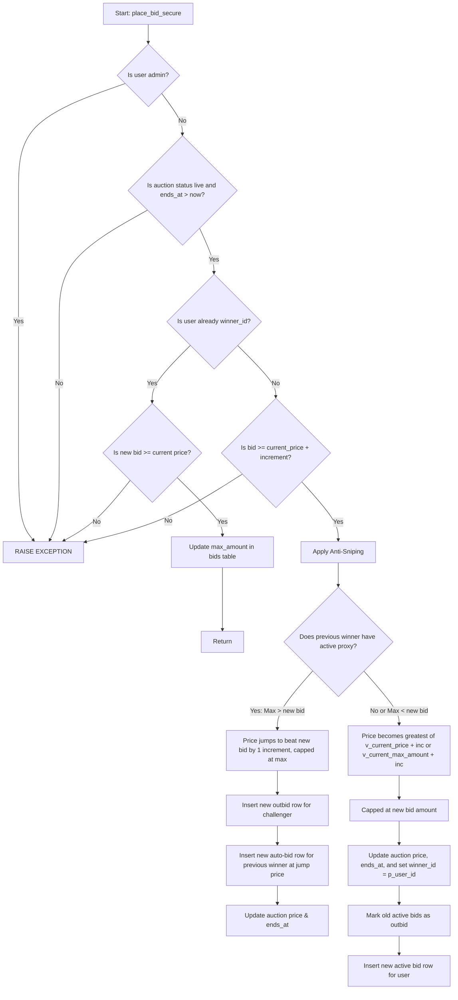

# Bidding Engine, Proxies & Increments Protocol

This document outlines the real code flows, patterns, and database validations governing bidding, dynamic increments, proxy bids, and front-end state synchronization for the **Virginia Liquidation** auction marketplace.

---

## 1. Dynamic Bidding Increments Calculation

To keep bidding clean and fast, bidding increments are calculated dynamically based on the current price of the item. Rather than static values, this is defined by a central plpgsql function `public.calculate_next_increment(p_price DECIMAL)` in the database and mirrored in typescript.

### Palier Bracket Rules (Scale)

| Current Hammer Price Bracket | Bidding Increment |
|:-----------------------------|:------------------|
| `$0.00 – $0.99`              | `$0.10`           |
| `$1.00 – $2.99`              | `$0.50`           |
| `$3.00 – $9.99`              | `$1.00`           |
| `$10.00 – $24.99`            | `$2.00`           |
| `$25.00 – $49.99`            | `$2.50`           |
| `$50.00 – $99.99`            | `$5.00`           |
| `$100.00 – $149.99`          | `$7.50`           |
| `$150.00 – $199.99`          | `$10.00`          |
| `$200.00 – $499.99`          | `$15.00`          |
| `$500.00 – $549.99`          | `$25.00`          |
| `$550.00 – $599.99`          | `$30.00`          |
| `$600.00 – $1,999.99`        | `$50.00`          |
| `$2,000.00 – $29,999.99`      | `$100.00`         |
| `$30,000.00 – $39,999.99`     | `$300.00`         |
| `$40,000.00 – $49,999.99`     | `$400.00`         |
| `$50,000.00 – $99,999.99`     | `$500.00`         |
| `$100,000.00 – $149,999.99`   | `$1,000.00`       |
| `$150,000.00 – $199,999.99`   | `$1,500.00`       |
| `$200,000.00 – $249,999.99`   | `$2,000.00`       |
| `$250,000.00 – $299,999.99`   | `$2,500.00`       |
| `$300,000.00 – $349,999.99`   | `$3,000.00`       |
| `$350,000.00+`               | `$3,500.00`       |

### Cent / Half-Dollar Preservation Rule
When competing proxy bids auto-escalate the price, the database rounding code ensures we avoid odd cents (like `$15.10` or `$15.60`). 
* If a price jump results in cents, we round up to the nearest whole integer (`ceil(v_new_price)`).
* **Exception:** Half-dollar steps (e.g. `$2.50`, `$7.50`) are **actively preserved**. If the resulting price has a `.50` decimal, it is kept intact rather than rounded up.

---

## 2. Server Action & Validation (`placeBid`)

The server-side entry point for submitting a bid is `placeBid` inside `app/actions/bids.ts`. It performs preliminary validations:
1. **Time Checks:** Asserts that bidding has started (`start_at`) and that the event has not closed (`ends_at`).
2. **Leader Bid Limits:**
   * If the current user is already winning (`winner_id === user.id`), they can set their new bid limit to **any value greater than or equal to the current auction price** (`amount >= current_price`). This allows them to adjust (raise or lower) their proxy ceiling.
   * If the user is NOT winning, they must bid at least the current price plus one dynamic increment (`amount >= current_price + calculateNextIncrement(current_price)`).

---

## 3. Database Engine (`place_bid_secure` RPC)

Once validated by the server action, the database RPC `place_bid_secure(p_auction_id, p_user_id, p_amount, p_stripe_pi_id, p_max_amount)` is executed. It runs inside a transaction, locking the target row (`FOR UPDATE`) to ensure atomic execution.

### Key Phases of the Database Execution:
1. **Admin Restriction:** Admins are blocked from bidding (`v_user_role = 'admin'`).
2. **Current Winner Proxy Update:**
   * If the user is the leader, the RPC retrieves their current active bid.
   * If their new amount is less than the current price of the lot, it raises an exception.
   * Otherwise, it directly updates the `max_amount` of their active bid row and returns, without changing the auction price or creating new logs.
3. **Anti-Sniping Protocol:**
   * If the bid is received within `auto_extend_threshold_mins` (e.g. 2 minutes) of closing, `ends_at` is extended by `auto_extend_duration_mins` (e.g. 2 minutes).
4. **Proxy Duels (Scenario Confrontations):**
   * **Scenario 1 (Current winner wins proxy duel):** The new bid is registered as `outbid`. The current winner's price is bumped to `challenger_bid + calculate_next_increment(challenger_bid)` (capped at their max limit). A new auto-bid row is created to log this price hike.
   * **Scenario 2 (Challenger wins proxy duel):** The previous active bids are marked `outbid`. The challenger becomes the new winner. The price rises to one increment above the previous proxy (capped at the challenger's bid amount). A new active bid row is created for the challenger.

---

## 4. Frontend Integration & Real-time Synchronization

### Bidding UI Widgets
* **`AuctionCard.tsx` (Grid item):** Prefills the `Bid / Max Bid` field with `realtimePrice + increment`. If the user is winning, the sliding floor logic relaxes, allowing them to lower their proxy limit down to the current price.
* **`BiddingWidget.tsx` (Detail page):** Aligns with the same prefill logic. Uses the database `winner_id` passed as a prop from `AuctionDetailsRealtime.tsx` to determine the winning status reliably (avoiding ties on equal-amount bid rows).

### Real-time Subscriptions
To avoid layout resets or clearing search parameters when Next.js server actions trigger page revalidations, local React state is synchronized via Supabase PostgreSQL realtime change events:
1. **Grid view (`AuctionGrid.tsx`):** Listens to `postgres_changes` on `auctions` and `bids`. It merges fresh properties (price, winner_id, userMaxBid, bidCount, endsAt) directly into the active client-side items array without resetting pagination.
2. **Profile dashboard (`ClientProfile.tsx`):** Listens to realtime changes. Whenever a bid is placed or an auction updates on any lot in the user's active bids or watchlist, `fetchData()` is re-triggered automatically. This keeps the "Leading" / "Outbid" status, KPI counts, and listings synchronized without manual page reloads.
