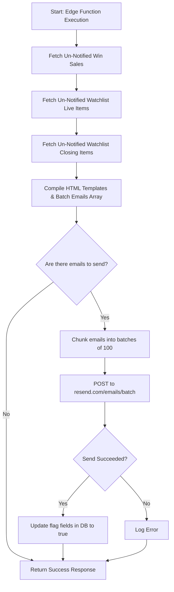

# Notification Engine & Batch Email System

This document outlines the real code flow and batch processing architecture used to deliver outbid alerts, watchlists notifications, and auction wins without hitting Resend rate-limiting bottlenecks.

---

## 1. The Rate-Limiting Challenge & Batching

Sending transaction emails immediately during high-velocity bidding wars can trigger HTTP 429 (Too Many Requests) errors from the email provider (Resend). 

To prevent this, the platform uses a **Consolidated Batch Engine** triggered by a cron scheduler:
* **Cron Job:** Runs every minute (`* * * * *`) in the database, executing the `public.check_and_notify_watchlist()` function.
* **HTTP POST Call:** The database function calls the Supabase Deno Edge Function `notify-watchlist-closing` via the `net.http_post` extension.

---

## 2. Deno Edge Function Flow (`notify-watchlist-closing`)

The edge function (`supabase/functions/notify-watchlist-closing/index.ts`) operates in a single execution sweep, preparing emails for 3 different types of notifications:

### The 3 Notification Pipelines:

### 🏆 1. Auction Wins (Winning Notifications)
* **Target:** Fetches pending sales records where `winning_notified` is `false`.
* **Action:** Prepares a custom email with the invoice link (`/invoices/[id]`) and item details.
* **DB Update:** Marks `winning_notified = true`.

### ⚡ 2. Watchlist Live (Start Notifications)
* **Target:** Fetches `watchlist` items linked to auctions that have just transitioned to `live` (based on `start_at` timestamps) where `notified_live` is `false`.
* **Action:** Prepares a "Bidding Now Open" alert.
* **DB Update:** Marks `notified_live = true`.

### 🚨 3. Watchlist Closing (Sniping Alerts)
* **Target:** Fetches `watchlist` items linked to auctions closing in less than 60 minutes, where `notified_closing_soon` is `false`.
* **Action:** Prepares a "Closing Soon" alert with the time remaining.
* **DB Update:** Marks `notified_closing_soon = true`.

---

## 3. Resend Batch API Integration

After preparing all emails:
1. **Chunking:** The function slices the `batchEmails` array into chunks of **100 emails** (the maximum batch size supported by Resend).
2. **Batch Dispatch:** Sends a single POST request to `https://api.resend.com/emails/batch` for each chunk.
3. **Database Flag Update:** If the batch API returns success, the corresponding records are updated in the database using their unique IDs to prevent duplicate transmissions.
