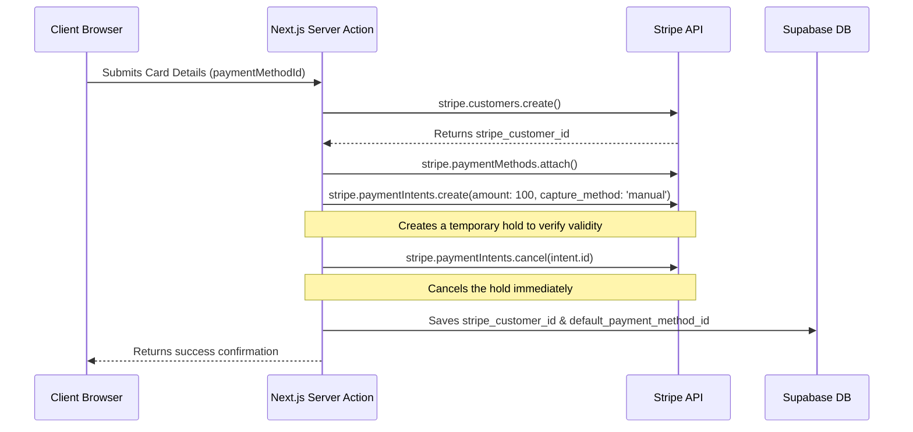
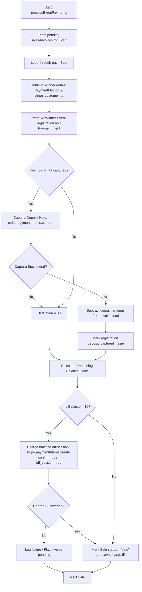

# Stripe Integration & Financial Transaction Protocol

This document details the real code implementation and transaction flow governing payment method verification, event registration holds, winner auto-debit billing, and deposit releases at **Virginia Liquidation**.

---

## 1. Credit Card Verification Flow

When a user signs up (`signUp` in `app/actions/auth.ts`) or adds a card to their profile (`addPaymentMethod` in `app/actions/payment.ts`), the system verifies the payment card before saving it.

### Verification Verification Steps:
1. **Customer Creation:** If the user has no existing customer reference, a new Customer profile is registered on Stripe. The resulting `stripe_customer_id` is updated on the user's `profiles` row.
2. **Method Attachment:** The card payment method is attached to the Stripe customer.
3. **Card Authorization Hold (Anti-Fraud):** Creates a manual-capture PaymentIntent for `$1.00`.
4. **Immediate Cancel:** The PaymentIntent is immediately cancelled (`stripe.paymentIntents.cancel`). This tests the card status against fraud/solvability filters without capturing money.
5. **Database Sync:** The Stripe PaymentMethod ID is saved to the profile's `default_payment_method_id` column.

---

## 2. Event Registration holds (Security Deposit)

Before participating in any auction event, users must register. This action triggers `createRegistration` inside `app/actions/registrations.ts`.

* **Deposit Authorized hold:** The system creates a PaymentIntent with `capture_method: 'manual'` (a hold/pre-authorization) for the event's required deposit amount (e.g. `$100.00`).
* **Storage:** The authorized PaymentIntent ID is saved in `event_registrations.stripe_payment_intent_id`.
* **Participating Gate:** Bidding validations (on cards/widgets) check that an active event registration with an authorized Stripe hold exists for the bidder.

---

## 3. Bid-Time Exemption (Performance Optimization)

To prevent database locks, rate-limit bottlenecks (Stripe 429), and payment latency during fast-paced bidding wars, **no payment intents or authorization holds are created on individual bids**.
* The server action simply verifies that the user is registered (meaning the deposit hold has already been authorized) and that a default card exists on their profile.
* This ensures zero-friction bidding.

---

## 4. Auction Clôture (`close-auction` Edge Function)

When a lot's timer expires, the closing Cron triggers the Deno Edge Function `close-auction` (`supabase/functions/close-auction/index.ts`):
1. Fetches the highest active bid row (`status = 'active'`).
2. Marks the auction status as `'sold'` and sets its `winner_id` to the winning user's ID.
3. Updates the winning bid status to `'won'`.
4. **No immediate debit occurs.** Transactions are consolidated at the event level.

---

## 5. Event Invoicing & Subtractive Auto-Debit

Once the entire auction event ends, or when triggered manually by administrators, payments are processed at the invoice level via `processEventPayments(eventId)` inside `app/actions/payment.ts`.

This is done using **subtractive pricing logic** to ensure the registration deposit hold is deducted from the final hammer price:

### Invoicing Execution Steps:
1. **Invoice Compilation:** A single `sales` record groups all lots won by the same user in that event (consolidated invoicing). The total includes the hammer prices, buyer's premium (e.g. 15-18%), and taxes.
2. **Deposit Capture & Deduction:** The system fetches the user's registration deposit PaymentIntent.
   * The deposit is captured: `stripe.paymentIntents.capture(pi_id)`.
   * If captured successfully, the deposit amount is subtracted from the invoice total.
3. **Off-Session Balance Charge:** 
   * If there is a remaining balance, a new PaymentIntent is created with `confirm: true` and `off_session: true` (using the customer's default payment method).
   * If successful, the final charge ID is linked to the invoice, and the sale status is updated to `'paid'`.

---

## 6. Deposit Releases for Non-Winners

For participants who registered but did not win any items during the event, the system frees their funds:
* **`releaseEventDeposits(eventId)`** is executed.
* It fetches all registrations for the event where `status = 'authorized'` and `deposit_captured = false`.
* It calls `stripe.paymentIntents.cancel(reg.stripe_payment_intent_id!)` to release the pre-authorization hold back to the participant's card.
* Updates the registration status to `'released'`.
